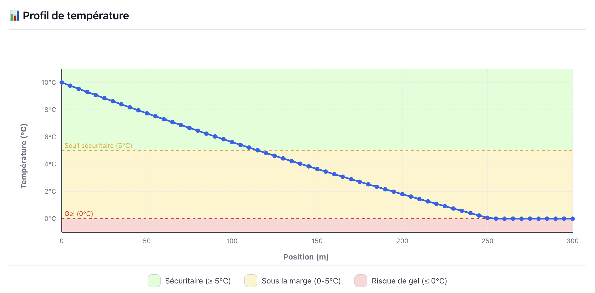
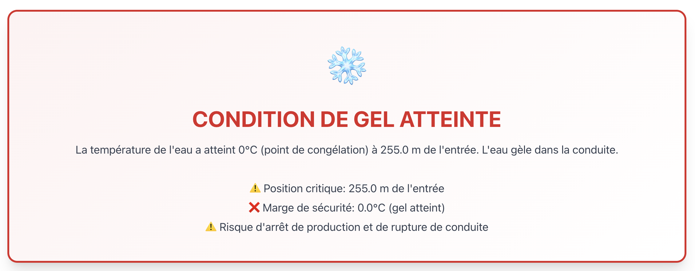
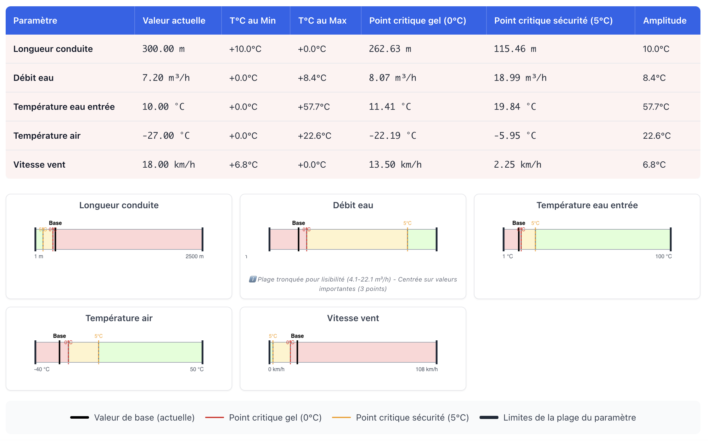

# ❄️ ThermaFlow

<div align="center">
  
  
</div>

<div align="center">
  
  
</div>

<div align="center">

[](https://github.com/perrongu/thermaflow)
[](LICENSE)

</div>

**Déterminez en quelques secondes si votre conduite d'eau risque de geler.**

ThermaFlow calcule scientifiquement l'évolution de la température de l'eau le long d'une conduite exposée au froid et vous indique immédiatement: ✅ **PAS DE RISQUE DE GEL** ou 🔴 **RISQUE DE GEL**.

Application web gratuite pour **ingénieurs**, **techniciens**, **gestionnaires** et **étudiants** qui doivent analyser le risque de gel dans les conduites d'eau.

## ✨ Fonctionnalités

### Interface

- 🎨 **Schéma 3D interactif** - Vue isométrique de la tuyauterie
- 📊 **Graphique T(x)** - Profil de température avec zones de risque
- 🔴 **Verdict immédiat** - Résultat clair et sans ambiguïté
- 📈 **Analyse de sensibilité** - Tableau points critiques (1D) + Heatmap (2D)
- 📄 **Export rapport** - Sauvegarde des résultats

### Capacités

- 🌐 **4 langues** - FR, EN, ES, PT
- 🔄 **Unités flexibles** - Métrique (m³/h, kPag) ou Impérial (USGPM, psig)
- ♿ **Accessible** - Conforme WCAG 2.1, navigation clavier
- ⚡ **Instantané** - Résultats en < 1 seconde
- 🔒 **100% local** - Aucune donnée envoyée en ligne

### Calculs

- **Hydraulique** - Reynolds, friction (Colebrook), perte de charge
- **Thermique** - Convection (Gnielinski, Churchill-Bernstein), conduction, rayonnement (méthode NTU-ε)
- **Matériaux** - Acier, cuivre, inox + isolants
- **Fluides** - Eau (IAPWS-97) et air (-50 à +30°C)

## 🚀 Installation

### En ligne

Visitez **[https://perrongu.github.io/thermaflow](https://perrongu.github.io/thermaflow)**

### Local

**Option 1: Téléchargement ZIP** (recommandé pour la plupart des utilisateurs)

1. Cliquez sur le bouton **`<> Code`** en haut de cette page
2. Sélectionnez **`Download ZIP`**
3. Extrayez le fichier ZIP
4. Ouvrez `index.html` dans votre navigateur

**Option 2: Git**

```bash
git clone https://github.com/perrongu/thermaflow.git
cd thermaflow
open index.html
```

**Aucune installation requise** - L'application fonctionne directement dans le navigateur (HTML/CSS/JS pur).

### Configuration

- **Langue**: Sélecteur en haut à droite (`FR` `EN` `ES` `PT`)
- **Unités**: Dropdowns dans le formulaire (m³/h ↔ USGPM, kPag ↔ psig)
- **Préférences**: Sauvegardées automatiquement entre sessions

## 📖 Cas d'utilisation

### 1. Shutdown avec circulation réduite

**Situation**: Arrêt d'urgence prévu 48h, conduite DN80 acier, 150m extérieure non isolée, eau 15°C, température -20°C. Débit normal 50 USGPM impossible, réduction à 5 USGPM possible.  
**Question**: Est-ce que 5 USGPM de circulation minimale empêche le gel?  
**Utilisation**: Tester différents débits réduits pour déterminer le débit critique de protection.

### 2. Design nouveau pipeline

**Situation**: Nouvelle conduite extérieure 300m, eau 60°C, débit 25 USGPM, air -15°C hiver typique.  
**Question**: Quelle épaisseur d'isolation minimale requise?  
**Utilisation**: Tester différentes configurations (matériau, isolation) pour dimensionnement optimal.

### 3. Estimation bénéfice énergétique isolant

**Situation**: Conduite existante DN50 cuivre, 80m exposée, non isolée actuellement.  
**Question**: Économie sur pertes thermiques avec isolation 20mm?  
**Utilisation**: Comparer scénarios avec/sans isolation. Analyse de sensibilité pour identifier paramètres critiques.

## ⚠️ Conditions d'utilisation

**Important**: Les résultats sont à titre **indicatif seulement**. Cette application ne remplace pas l'analyse d'un professionnel qualifié.

### Plages de validité

- **Température eau**: 1 à 100°C
- **Température air**: -50 à +30°C
- **Pression**: 1 à 10 bar
- **Longueur**: 1 à 2500 m

### Hypothèses

- Fluide: Eau pure (sans glycol ni additifs)
- Régime: Permanent (état stationnaire)
- Environnement: Air ambiant
- Géométrie: Conduite droite horizontale

### Responsabilité

L'utilisateur assume l'entière responsabilité de l'utilisation des résultats. Toujours consulter un ingénieur qualifié pour les applications critiques.

## 🔬 Validation scientifique

ThermaFlow est basé sur des standards industriels reconnus et validé scientifiquement.

### Références

- **Perry's Chemical Engineers' Handbook (9th Ed., 2016)** - Corrélations thermiques et hydrauliques (Sections 2, 5, 6)
- **IAPWS-97** - Propriétés de l'eau (standard international)
- **PINT** - Conversions d'unités (compatibilité bibliothèque Python standard)

### Validation

- **Suite complète de tests** - 19 fichiers tests, 142 tests unitaires (100% passent)
- **Validation croisée** - 50 cas comparés avec Aspen Hysys, AFT Fathom, DWSIM (±1.5°C)
- **Conservation d'énergie** - Vérifiée sur tous les calculs
- **JSDoc complet** - Toutes fonctions documentées avec références scientifiques

### Limites techniques

#### Conditions idéales (Confiance > 95%)

- Température: Eau 5-80°C, Air -30 à +40°C
- Hydraulique: 4000 < Re < 100000 (turbulent modéré)
- Configuration: Matériaux standards, isolation ≥ 10 mm
- Variation: ΔT < 10K par segment

#### Conditions limites (Confiance 80-95%)

- **Zone transitoire** (Re 2300-4000): Incertitude ±30% → Facteur sécurité **1.5**
- **Sans isolation**: Sous-estimation 5-15% pertes → Facteur sécurité **1.2**
- **ΔT élevé** (> 30K): Propriétés variables → Facteur sécurité **1.2**
- **Températures extrêmes**: Eau < 5°C ou > 80°C, Air < -30°C → Facteur sécurité **1.3**

#### Hors limites (Non calculé)

- Eau < 0°C ou > 100°C (changement de phase)
- Pression > 10 bar

**Documentation complète**: [Rapport de validation](docs/AUTOMATED_VERIFICATION_LATEST.md) | [Références scientifiques](docs/REFERENCES.md)

## 🛠️ Qualité et méthodologie

### Tests automatisés

```bash
npm run verify  # Suite complète (~15s)
npm run lint    # ESLint (0 erreurs, 0 warnings)
npm run format  # Prettier (formatage cohérent)
```

**Résultats**: 19/19 fichiers tests, 142/142 tests passent ✅

### Infrastructure qualité

- ✅ **Hook pre-commit** - Validation automatique (format + lint + tests + rapport)
- ✅ **ESLint + Prettier** - Standards code maintenus automatiquement
- ✅ **Validation scientifique** - Comparaison multi-sources (Perry's, fluids.readthedocs.io)
- ✅ **Versionnage centralisé** - Source unique de vérité (`js/constants/version.js`)

### Documentation technique

- **[CHANGELOG](docs/CHANGELOG.md)** - Historique des versions
- **[Validation automatisée](docs/AUTOMATED_VERIFICATION_LATEST.md)** - Rapport complet
- **[Flow scientifique](docs/SCIENTIFIC_DATA_FLOW.md)** - Traçabilité données → calculs
- **JSDoc inline** - Documentation avec références Perry's/IAPWS

## 🤝 Contribution

Les contributions sont bienvenues! Le code suit des standards rigoureux:

- JSDoc complet sur toutes les fonctions
- Validation stricte des entrées
- Tests unitaires systématiques
- Références scientifiques citées

Voir les modules existants pour les patterns à suivre.

## 📄 Licence

MIT License - Voir [LICENSE](LICENSE) pour détails.

---

**ThermaFlow v1.1.7** | Calculs scientifiques rigoureux | 100% open source

Pour questions ou support: [Ouvrez une issue sur GitHub](https://github.com/perrongu/thermaflow/issues)
