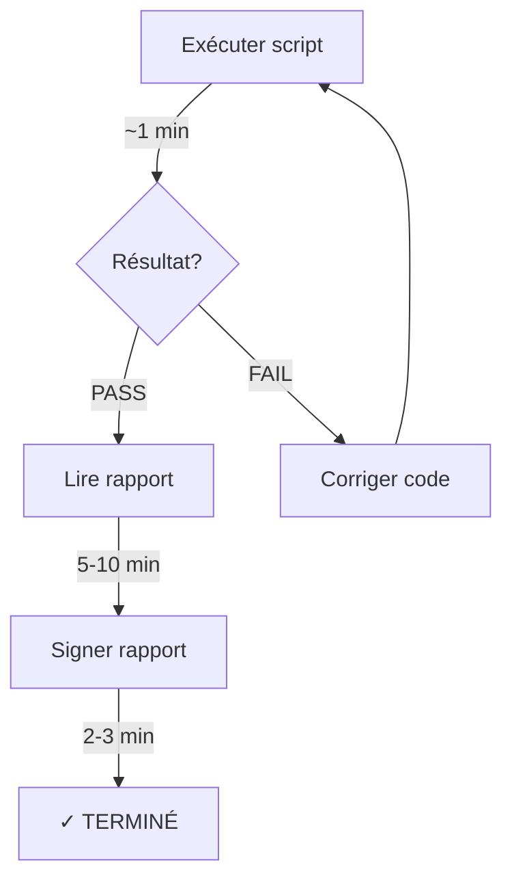

# GUIDE RAPIDE - VÉRIFICATION 30 MINUTES

**Date**: 2025-10-30  
**Temps estimé**: 30 minutes maximum  
**Processus**: 95% automatisé

---

## 🚀 DÉMARRAGE RAPIDE

### Commande unique

```bash
cd /Users/guillaumeperron/Documents/00-CODE-GIT/thermaflow
node tests/automated_verification.js
```

**C'est tout!** Le script fait automatiquement:

1. ✅ Validation de ~15 constantes physiques critiques
2. ✅ Validation de 25 conversions d'unités
3. ✅ Exécution de 14 tests unitaires
4. ✅ Validation externe (si données disponibles)
5. ✅ Génération d'un rapport concis (`docs/AUTOMATED_VERIFICATION_YYYY-MM-DD.md`)

---

## ⏱️ TIMELINE (10-15 MINUTES)

| Étape                        | Durée    | Action                             |
| ---------------------------- | -------- | ---------------------------------- |
| **1. Exécution automatique** | ~1-2 min | Script valide tout automatiquement |
| **2. Lecture du rapport**    | 5-10 min | Lire et comprendre les résultats   |
| **3. Signature**             | 2-3 min  | Signer si tout est PASS            |

**Total**: ~10-15 minutes

---

## 📋 DÉTAIL DES ÉTAPES

### Étape 1: Exécution (10-15 min)

```bash
# Depuis la racine du projet
node tests/automated_verification.js
```

**Le script affiche en temps réel**:

- `✓` Constante validée
- `✗` Échec détecté
- Progression des tests

**Résultat attendu**:

```
╔═══════════════════════════════════════════╗
║    RÉSUMÉ FINAL                           ║
╚═══════════════════════════════════════════╝

Constantes : 15/15 ✓
Conversions: 12/12 ✓
Tests      : 12/12 ✓

Rapport: docs/AUTOMATED_VERIFICATION_2025-10-30.md

✓ VÉRIFICATION RÉUSSIE - Prêt à signer
```

---

### Étape 2: Lecture du rapport (10-15 min)

**Ouvrir**: `docs/AUTOMATED_VERIFICATION_YYYY-MM-DD.md`

**Le rapport contient** (2-3 pages):

#### Section 1: Résumé exécutif

Tableau récapitulatif:

- Constantes: X/Y pass
- Conversions: X/Y pass
- Tests: X/Y pass

#### Section 2: Constantes physiques

Table avec toutes les constantes validées:

- Stefan-Boltzmann: ✓
- Gnielinski 12.7: ✓ (CRITIQUE)
- Colebrook 3.7, 2.51: ✓
- Etc.

#### Section 3: Conversions d'unités

Validation automatique de:

- bar → Pa
- °C → K
- L/min → m³/s
- mm → m

#### Section 4: Tests unitaires

Liste des 12 tests avec status PASS/FAIL

#### Section 5: Certification (À SIGNER)

Espace pour:

- Nom
- Titre/Position
- Signature
- Date

---

### Étape 3: Signature (2-3 min)

**Si tout est ✓ PASS**:

1. Imprimer ou éditer le PDF du rapport
2. Remplir la section CERTIFICATION:
   - Nom complet
   - Titre/Position
   - Signature manuscrite (si imprimé) ou digitale
   - Date

3. Sauvegarder le rapport signé

**Si des ✗ FAIL**:

1. ❌ **NE PAS SIGNER**
2. Consulter la section "Avertissements" du rapport
3. Corriger les problèmes dans le code
4. Ré-exécuter: `node tests/automated_verification.js`
5. Répéter jusqu'à 100% PASS

---

## 🔍 QUE VALIDE LE SCRIPT?

### 1. Constantes physiques critiques (~15 valeurs)

Le script extrait automatiquement du code et compare:

| Constante             | Valeur code    | Référence    | Status |
| --------------------- | -------------- | ------------ | ------ |
| Stefan-Boltzmann      | 5.670374419e-8 | CODATA 2018  | Auto ✓ |
| Gnielinski 12.7       | 12.7           | Perry's 5-12 | Auto ✓ |
| Colebrook 3.7         | 3.7            | Perry's 6-4  | Auto ✓ |
| Friction laminaire 64 | 64             | Perry's 6-4  | Auto ✓ |
| ...                   | ...            | ...          | Auto ✓ |

**Méthode**: Regex patterns pour extraire constantes, comparaison numérique avec tolérance

### 2. Conversions d'unités (12 cas de test)

Calculs automatiques:

- 1 bar = 100000 Pa ✓
- 20°C = 293.15 K ✓
- 60 L/min = 0.001 m³/s ✓
- Etc.

**Méthode**: Calcul direct avec valeurs test, comparaison avec résultats attendus

### 3. Tests unitaires (12 fichiers)

Exécution automatique de tous les tests:

- test_phase1_hydraulics.js
- test_phase1_heat_transfer.js
- test_phase1_materials.js
- ... (9 autres)

**Méthode**: `execSync()` pour chaque test, capture PASS/FAIL

### 4. Validation externe (optionnel)

Si le fichier `validation/external_validation_sample_v1.0.json` contient des données de logiciels de référence:

| Logiciel    | Paramètres comparés |
| ----------- | ------------------- |
| Aspen Hysys | T_out, ΔP, Q_loss   |
| AFT Fathom  | T_out, ΔP, Q_loss   |
| DWSIM       | T_out, ΔP, Q_loss   |

**Statistiques automatiques**:

- Écarts moyens ThermaFlow vs chaque logiciel
- Écarts vs moyenne des logiciels disponibles
- Identification cas avec écarts > seuils

**Seuils significatifs**:

- Température: > 3°C
- Pression: > 20 kPa ET > 30%
- Thermique: > 50%

**Méthode**: Recalcul automatique ThermaFlow, comparaison statistique

---

## 📊 CRITÈRES DE VALIDATION

**Pour signer le rapport, il faut**:

✅ **100% des constantes critiques** validées (Gnielinski, Stefan-Boltzmann, etc.)  
✅ **100% des conversions** correctes  
✅ **100% des tests** passent

**Tolérances**:

- Constantes physiques: ±0.01% (ou 0 pour valeurs entières)
- Conversions: ±1e-6 (précision double)
- Tests: PASS strict (pas de tolérance)

---

## 🔧 DÉPANNAGE

### Le script ne trouve pas une constante

**Cause**: Pattern regex ne matche pas le code

**Solution**: Vérifier que la constante est bien déclarée:

```javascript
const NOM_CONSTANTE = valeur; // OK
NOM_CONSTANTE = valeur; // OK
return valeur; // NOM_CONSTANTE // OK
```

### Un test échoue

**Cause**: Régression dans le code

**Solution**:

1. Voir logs: `tests/error_test_xxx.log`
2. Corriger le code
3. Ré-exécuter vérification

### Une constante a un écart

**Cause**: Valeur dans code ≠ référence

**Solution**:

1. Vérifier dans Perry's la valeur officielle
2. Corriger dans le code
3. Ré-exécuter vérification

---

## 📝 WORKFLOW COMPLET



---

## 🆘 AIDE RAPIDE

### Fichiers importants

- **Script**: `tests/automated_verification.js`
- **Références**: `tests/verification_references.json`
- **Rapport**: `docs/AUTOMATED_VERIFICATION_YYYY-MM-DD.md`

### Commandes utiles

```bash
# Vérification complète
node tests/automated_verification.js

# Tests seulement (sans validation constantes)
./tests/run_verification.sh

# Voir un test spécifique
node tests/test_phase1_hydraulics.js
```

### Contact

Pour questions sur:

- **Équations**: Consulter Perry's Handbook (disponible dans `docs/references/`)
- **Tests**: Voir logs dans `tests/error_*.log`
- **Script**: Lire commentaires dans `tests/automated_verification.js`

---

## ✅ CHECKLIST FINALE

**Avant de considérer la vérification complète**:

- [ ] Script exécuté: `node tests/automated_verification.js`
- [ ] Rapport généré dans `docs/`
- [ ] Résumé: 100% PASS pour constantes critiques, conversions et tests
- [ ] Rapport lu et compris (2-3 pages)
- [ ] Section CERTIFICATION signée et datée

**Durée totale**: 10-15 minutes ✓

---

**C'est tout! Vérification scientifique rigoureuse en 10-15 minutes grâce à l'automatisation.**

---

_Guide créé le 2025-10-30_  
_ThermaFlow v1.0.1 - Quick Verification System_
